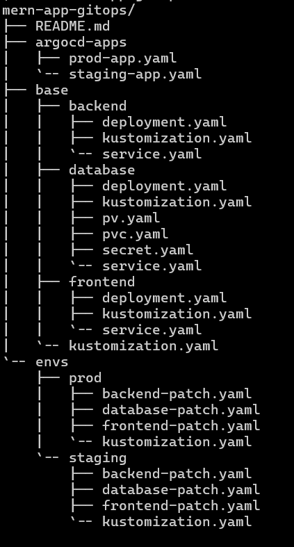
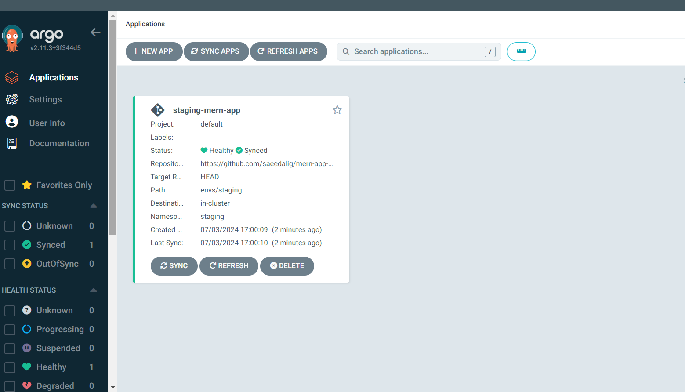
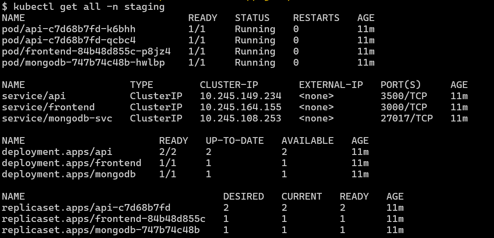
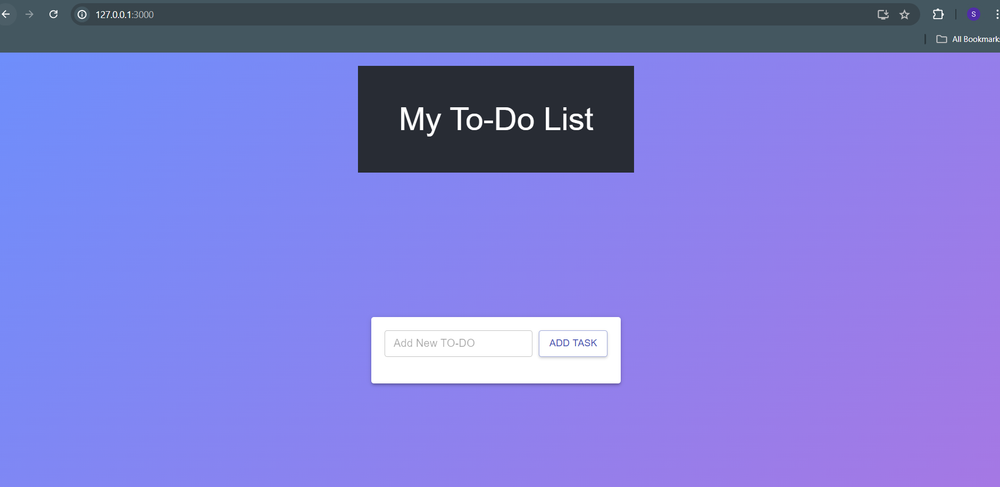
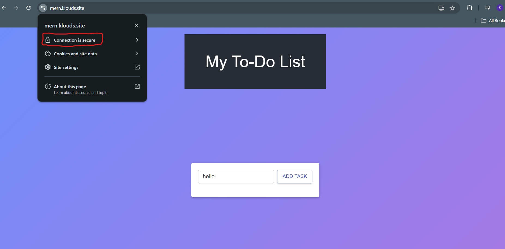

# MERN App Deployment with ArgoCD and Kustomize.

## Table of Contents
1. [Introduction](#introduction)
2. [How GitOps Works with Kubernetes](#how-gitops-works-with-kubernetes)
3. [Prerequisites](#prerequisites)
4. [Repository Structure](#repository-structure)
5. [Kustomize Configuration](#kustomize-configuration)
6. [ArgoCD Setup](#argocd-setup)
7. [Deployment and Promotion](#deployment-and-promotion)
8. [Managing Environments](#managing-environments)
9. [Cert-Manager and Let's Encrypt](#cert-manager-and-lets-encrypt)
10. [Troubleshooting](#troubleshooting)


## Introduction
This document provides a step-by-step guide for deploying a MERN (MongoDB, Express, React, Node.js) application to a Kubernetes cluster using ArgoCD and Kustomize following the `GitOps` principles. This setup supports multiple environments such as `prod` and `production`.

## How GitOps Works with Kubernetes
**Git Repository as the Source of Truth:**
In GitOps, the desired state of the Kubernetes cluster (e.g., deployments, services, configurations) is stored in a Git repository. This includes manifests, Helm charts, or Kustomize configurations.

**Continuous Reconciliation:**
A GitOps operator (e.g., ArgoCD, Flux) continuously monitors the Git repository for changes. When a change is detected, the operator reconciles the desired state defined in Git with the actual state of the Kubernetes cluster, applying updates as necessary.

**Automated Rollbacks:**
GitOps simplifies rollbacks by allowing you to revert to a previous state directly from the Git history. If an issue occurs, you can quickly restore the last known good configuration, enhancing the resilience and stability of the system.

**Declarative Configuration Management:**
Using declarative configurations, GitOps defines the desired state of the system, making it easier to understand, manage, and reproduce environments. This approach contrasts with imperative commands, providing a more robust and scalable way to manage Kubernetes clusters.


### ArgoCD Operator
ArgoCD operator is a `continuous delivery` tool for Kubernetes, designed to implement `GitOps practices`. Here's high level overview how ArgoCD works:

**Application:**
An ArgoCD application represents a collection of Kubernetes resources defined in a Git repository. It tracks the desired state (as defined in Git) and ensures the Kubernetes cluster reflects this state.

**Repositories:**
ArgoCD integrates with Git repositories where Kubernetes manifests, Helm charts, or Kustomize configurations are stored. These repositories act as the source of truth for your applications.

**Sync:**
The synchronization process involves comparing the desired state in Git with the actual state in the cluster. If there are differences, ArgoCD will reconcile them to ensure the cluster matches the desired state.

### Workflow
**Defining Applications:**
Applications are defined in ArgoCD either through its web UI, CLI, or declarative YAML files. These definitions include the source repository, the path within the repository where manifests are stored, and the target cluster/namespace for deployment.

**Continuous Monitoring:**
ArgoCD continuously monitors the specified Git repositories for changes. When a change is detected (e.g., a new commit to the repository), ArgoCD triggers the synchronization process.

**Sync and Deploy:**

- **Sync:** ArgoCD compares the current state of the cluster with the desired state defined in Git.
- **Deploy:** If there are differences, ArgoCD applies the necessary changes to the cluster. This can include creating, updating, or deleting resources to match the desired state.
**Health Checks and Status:**
ArgoCD performs health checks on resources to ensure they are in a healthy state post-deployment. It provides detailed status information about each resource, including whether it is synced and healthy.

**Rollbacks:**
If a deployment causes issues, ArgoCD allows for easy rollbacks. By reverting the changes in the Git repository to a previous state, ArgoCD will sync the cluster back to this stable state.

### Features
**Declarative GitOps:**
ArgoCD embraces a declarative approach, where the desired state is defined in Git, and the actual state is continuously reconciled to match this state.

**Multi-Cluster Support:**
ArgoCD can manage multiple Kubernetes clusters from a single ArgoCD instance, making it suitable for complex environments with multiple regions or stages.

**RBAC and Multi-Tenancy:**
ArgoCD provides role-based access control (RBAC) and supports multi-tenancy, enabling secure and organized management of different teams and applications.

**User Interface and CLI:**
ArgoCD offers a web UI and a CLI for managing applications, visualizing the state of resources, and performing operations like syncing and rolling back.

**Integrations:**
ArgoCD integrates with various CI/CD tools and services, including Jenkins, GitHub Actions, and more, facilitating a seamless continuous delivery pipeline.

## Prerequisites
- A `Kubernetes cluster`.
- `kubectl` installed locally.
- `ArgoCD` installed and configured in the cluster.
- `Kustomize` installed locally.
- `Docker` installed for building images.
- A `Docker Hub` account (or other container registry) for storing Docker images.

## Repository Structure
Here is the structure of the repository used for deploying the MERN app. I've maintained two separate git repositories for ensuring the best GitOps practices. This repo only contains the configuratins related to Kubernetes and ArgoCD.




## Kustomize Configuration

### Base
The base directory holds configuration which is common to all environments. It is not expected to change often. To better organize, subdirectories for `backend, frontend, and database,` are created each with their respective manifests.

#### Backend
- **deployment.yaml**: Deployment configuration for the backend service.
- **service.yaml**: Service configuration for the backend service.
- **kustomization.yaml**: Kustomize configuration file for the backend resources.

#### Frontend
- **deployment.yaml**: Deployment configuration for the frontend service.
- **service.yaml**: Service configuration for the frontend service.
- **kustomization.yaml**: Kustomize configuration file for the frontend resources.

#### Database
- **pv.yaml**: Persistent Volume configuration for MongoDB.
- **pvc.yaml**: Persistent Volume Claim configuration for MongoDB.
- **secret.yaml**: Secret to prevent hardcoding of credentials for MongoDB.
- **deployment.yaml**: Deployment configuration for the MongoDB service.
- **service.yaml**: Service to enable internal communication.
- **kustomization.yaml**: Kustomize configuration file for the database resources.

#### kutomization.yaml
- It is located at root level of base dir inheriting the base configurations.

```yaml
apiVersion: kustomize.config.k8s.io/v1beta1
kind: Kustomization

resources:
  - backend
  - frontend
  - database

```


### Environments
The `envs` directory contains environment-specific overlays. We can override the base configurations by patching the custom configurations like replica, image,etc.

#### prod
- **kustomization.yaml**: References the base and includes environment-specific patches.
- **backend-patch.yaml**: Specifies the backend Docker image and replica to be created for the prod environment.
- **frontend-patch.yaml**: Specifies the frontend Docker image and replica to be created for the prod environment.
- **database-patch.yaml**: Specifies the database Docker image and replica to be created for the prod environment.

```yaml
# kustomization.yaml
apiVersion: kustomize.config.k8s.io/v1beta1
kind: Kustomization

namespace: prod

resources:
  - ../../base
patches:
  - path: backend-patch.yaml
  - path: frontend-patch.yaml
  - path: database-patch.yaml

```

#### prod
- **kustomization.yaml**: References the base and includes environment-specific patches.
- **backend-patch.yaml**: Specifies the backend Docker image and replica to be created for the prod environment.
- **frontend-patch.yaml**: Specifies the frontend Docker image and replica to be created for the prod environment.
- **database-patch.yaml**: Specifies the database Docker image and replica to be created for the prod environment.

```yaml
# kustomization.yaml
apiVersion: kustomize.config.k8s.io/v1beta1
kind: Kustomization

namespace: prod

resources:
  - ../../base
patches:
  - path: backend-patch.yaml
  - path: frontend-patch.yaml
  - path: database-patch.yaml
  
```

## ArgoCD Setup

### ArgoCD Application Manifest
Since I'm deploying the applicatin in `prod` and `prod` envs, I also created the respective application definitions located at `argocd-apps/` directort with name `prod-app.yaml` and `prod-app.yaml`.

**prod-app.yaml:**

```yaml
--- 
apiVersion: argoproj.io/v1alpha1
kind: Application
metadata:
  name: prod-mern-app
  namespace: argocd
spec:
  project: default
  source:
    repoURL: 'https://github.com/saeedalig/mern-app-gitops.git'
    targetRevision: HEAD
    path: envs/prod
  destination:
    server: 'https://kubernetes.default.svc'
    namespace: prod
  syncPolicy:
    automated:
      prune: true
      selfHeal: true
      allowEmpty: false
    syncOptions:
      - CreateNamespace=true
```

**prod-app.yaml:**

```yaml
# prod-app.yaml`
--- 
apiVersion: argoproj.io/v1alpha1
kind: Application
metadata:
  name: prod-mern-app
  namespace: argocd
spec:
  project: default
  source:
    repoURL: 'https://github.com/saeedalig/mern-app-gitops.git'
    targetRevision: HEAD
    path: envs/prod
  destination:
    server: 'https://kubernetes.default.svc'
    namespace: prod
  syncPolicy:
    automated:
      prune: true
      selfHeal: true
      allowEmpty: false
    syncOptions:
      - CreateNamespace=true

```

Apply the application manifests.
```
kubectl apply -f argocd/prod-app.yaml
kubectl apply -f argocd/prod-app.yaml

```


Verify the resources in staging env.
```
kubectl get all -n staging
```


## Deployment and Promotion
Once the ArgoCD application definition is applied, ArgoCD will automatically monitor the specified `Git repository` for changes. Any updates to the Kustomize configurations or Docker image versions in the repository will be automatically synced to the Kubernetes cluster.

Firstly application needs to be deployed in prod environment. Once verified and test properly, it would get promoted to prod environment manually.
  - Manual promotion provides greater `control` over the deployment process. It allows teams to choose the `right time` for deployment, minimizing disruptions to users.

  - Manual promotion allows for better `coordination and communication with stakeholders`. Important updates can be communicated in advance, ensuring that all relevant parties are informed and prepared for the changes.

You can also apply the manifests in specific env by running the following command
```
kubectl apply -k kustomize/envs/prod
kubectl apply -k kustomize/envs/prod
```

Access the Application on port 3000




## Cert-Manager and Let's Encrypt
`Let's Encrypt` is a free, automated, and open Certificate Authority (CA) that provides SSL/TLS certificates to enable HTTPS on websites and secure communication over the internet.

By leveraging `Cert-Manager`, a Kubernetes native solution, the process of obtaining and renewing certificates from Let's Encrypt becomes seamless and efficient. Cert-Manager automates the certificate lifecycle management, handling tasks such as domain validation and certificate renewal, thereby minimizing manual effort and reducing the risk of certificate expiration. 

### Guide to setup

**Step 1: Install Cert-Manager**
First, install Cert-Manager in your Kubernetes cluster.
```bash
kubectl apply --validate=false -f https://github.com/jetstack/cert-manager/releases/download/v1.9.1/cert-manager.yaml
```
Verify
```bash
kubectl get pods --namespace cert-manager
```

**Step 2: Create a ClusterIssuer for Let's Encrypt**
Create a ClusterIssuer resource to define how Cert-Manager should obtain certificates from Let's Encrypt. Choose between the staging environment (for testing) and the production environment (for live use).

```yaml
apiVersion: cert-manager.io/v1
kind: ClusterIssuer
metadata:
  name: letsencrypt-staging
spec:
  acme:
    server: https://acme-staging-v02.api.letsencrypt.org/directory
    email: your-email@example.com # put your email
    privateKeySecretRef:
      name: letsencrypt-staging
    solvers:
    - http01:
        ingress:
          class: nginx

```
Apply the ClusterIssuee
```bash
kubectl apply -f clusterissuer.yaml
```

**Step 3: Create a Certificate Resource**
Create a Certificate resource for your domain. This resource requests a certificate from Let's Encrypt using the ClusterIssuer you just created.

```yaml
apiVersion: cert-manager.io/v1
kind: Certificate
metadata:
  name: mern-app
  namespace: staging
spec:
  secretName: mern-app-certificate-tls
  issuerRef:
    name: letsencrypt-staging
    kind: ClusterIssuer
  commonName: mern.klouds.site
  dnsNames:
  - mern.klouds.site
```

Apply the certificate
```bash
kubectl apply -f certificate.yaml
```

**Step 4: Create or Update Ingress to Use the Certificate**

```yaml
apiVersion: networking.k8s.io/v1
kind: Ingress
metadata:
  name: mern-ingress
  namespace: staging
  annotations:
    cert-manager.io/cluster-issuer: letsencrypt-staging
    nginx.ingress.kubernetes.io/rewrite-target: /
spec:
  tls:
  - hosts:
    - mern.klouds.site
    secretName: mern-app-certificate-tls
  ingressClassName: nginx
  rules:
  - host: mern.klouds.site
    http:
      paths:
      - path: /api
        pathType: Prefix
        backend:
          service:
            name: api
            port:
              number: 3500
      - path: /
        pathType: Prefix
        backend:
          service:
            name: frontend
            port:
              number: 3000
```

Apply the updated Ingress resource:

```bash
kubectl apply -f ingress.yaml
```
**Step 5: Verify the Setup**
Check the status of the certificate issuance by inspecting the Certificate resource:

```bash
kubectl describe certificate your-certificate -n staging
```
You should see the certificate details and status. Also, verify that your domain now has a valid HTTPS certificate issued by Let's Encrypt.

Finally, browse the application with **https://mern.klouds.site**  



## Managing Environments
To manage different environments, modify the `kustomization.yaml` and other respective configuration files under the respective environment directories.


## Troubleshooting
If you encounter issues, check the following:

- ArgoCD application status from UI or using ArgoCD CLI.
- Kubernetes pod logs.
- Kustomize build output.

